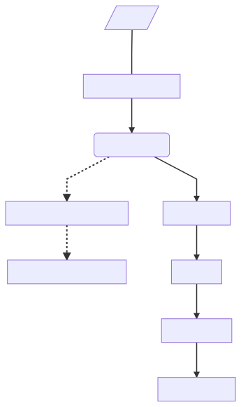

# CoV-SARS-2 Genome Tracker

Abstract: Genome sequences constitute the primary evidence on the origin and spread of the 2019-2020 Covid-19 pandemic. Rapid comparative analysis of coronavirus CoV-SARS-2 genomes is critical for disease control, outbreak forecasting, and for developing clinical interventions. With CoV Genome Tracker we trace viral genomic changes in real time using a haplotype network, an accurate and scalable representation of evolutionary changes at micro-evolutionary time scale. We resolve direction of mutations by using a bat-associated genome as the outgroup. At the macro-evolutionary time scale, the Genome Tracker provides gene-by-gene and codon-by-codon evolutionary rates to facilitate the search for molecular targets of clinical interventions.

This is the repository for the CoV-SARS-2 Genome Tracker <http://cov.genometracker.org>

# Outline 

1. Download hCoV-19 genomic sequences from [GISAID](https://www.gisaid.org/)
2. Parse sequences and meta-data using parse-metadata.ipynb
3. 
    - a. Align each hCoV-19 genome to an NCBI reference genome, Wuhan-Hu-1, accession ID [NC_045512](https://www.ncbi.nlm.nih.gov/nuccore/NC_045512) with align-genome.sh
    - b. Identify variation sites with [samtools](https://github.com/samtools/samtools/releases/download/1.10/samtools-1.10.tar.bz2) and [bcftools](https://github.com/samtools/bcftools/releases/download/1.10.2/bcftools-1.10.2.tar.bz2), and create a haplotype alignment using bcftools using infer-genome.sh
4. Discard haplotypes with missing 10% or more bases then identify haplotype imputing interior missing bases with closest haplotype 
5. Build minimum spanning tree for unique haplotypes using hapnet.pl
6. Create a bootstrap alignments and infer networks using hapnet-boot.pl
7. Get consensus network using net-consense.pl


### Workflow




### Parse metadata

```
parse-metadata.ipynb
```
parse-metadata reads the GISAID hCov-19 sequence metadata and adds geo-location.  It outputs into the following formats:

- `gisaid-covid19-[current_date].xlsx` 
- `covid-19-[current_date].tsv` 
- `covid-19-[current_date].csv`
- `covid-[current_date].fasta`


### align-genome.sh

Align each CoV-SARS-2 isolates from GISAID to the NCBI reference genome Wuhan-Hu-1 (Genbank accession ID: [ NC_045512](https://www.ncbi.nlm.nih.gov/nuccore/NC_045512))

input: fasta containing hCov-19 genome, reference seq Wuhan-Hu-1, ploidy file, folder name bamfile for non-human sequences, outgroup (sorted bam file).

```
infer-genome.bash [ covid-[file_date.fasta] ] [Wuhan-Hu-1 reference sequence] [vcf ploidy file] [folder name that contains non-human cov genome bam files] [outgroup bam file]
```

### impute-hap.pl

Estimating missing genotypes from haplotype or genotype reference panel.

- input:
  - SAM file containing haplotypes with each sequence < 10% gaps (any non-ATGC: "n", "." or "-")

- output
  - log file with the removed sequences with 10% gaps or more
  - sequence type (ST) alignment 
  
```
impute-hap.pl [input] []
```

### hapnet.pl

Reconstruct a network of unique haplotypes
This program calculates the minimum spanning tree of a set haplotype.

```
hapnet.pl
```


